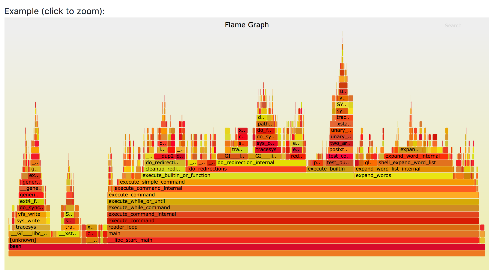
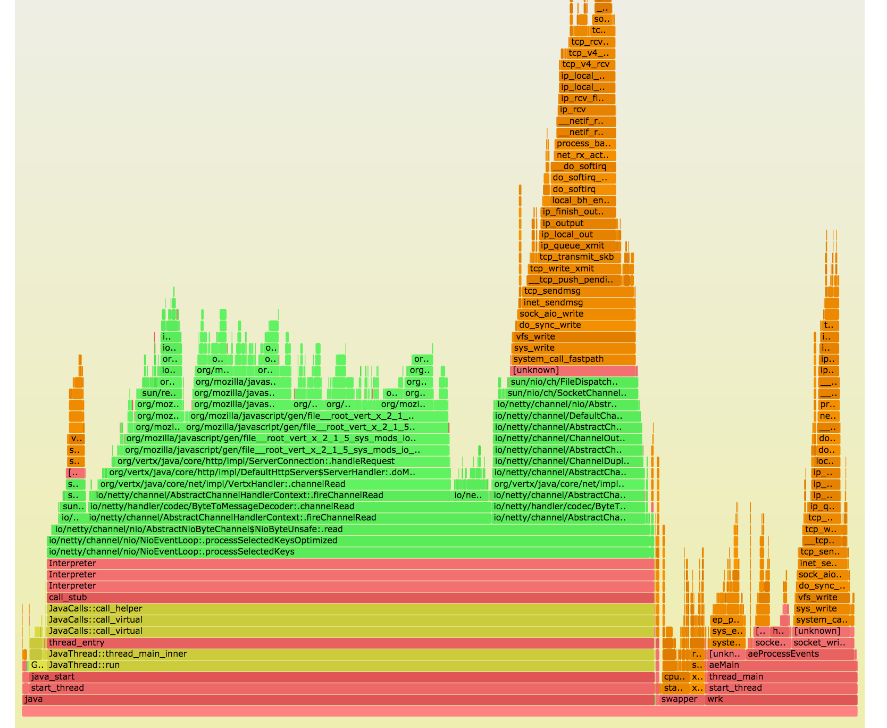
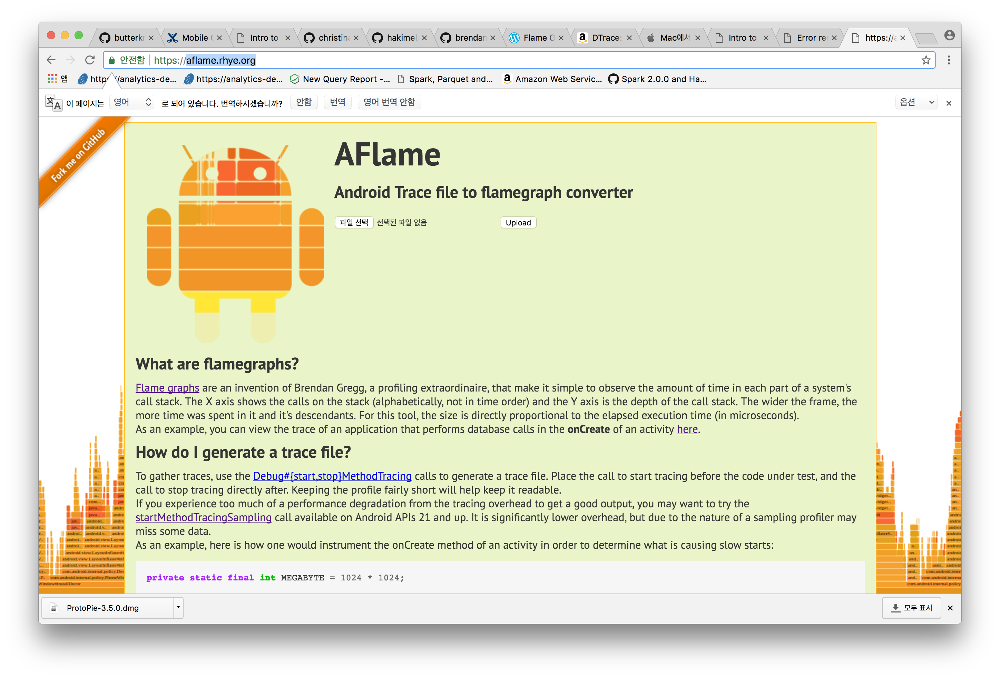
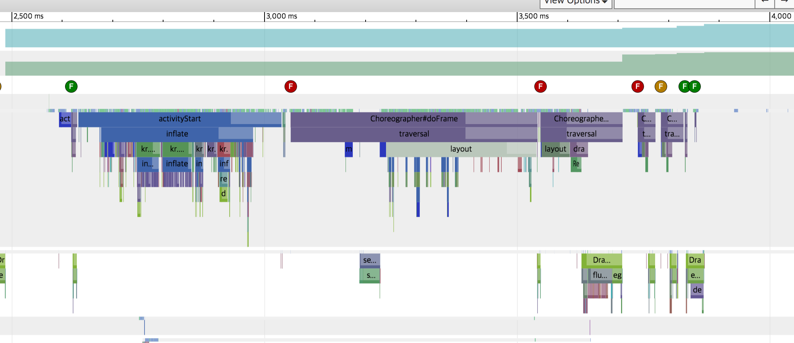
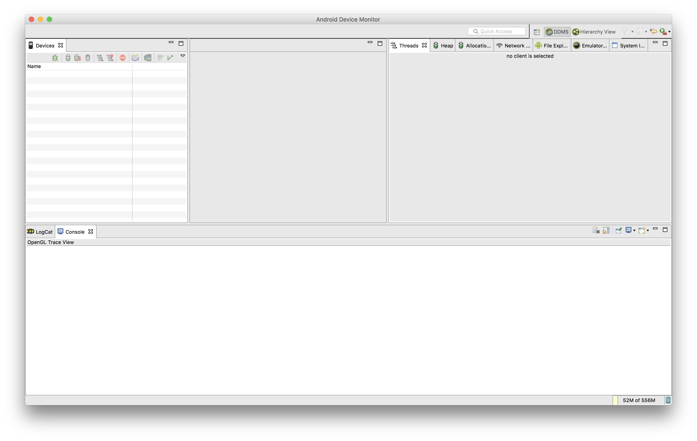
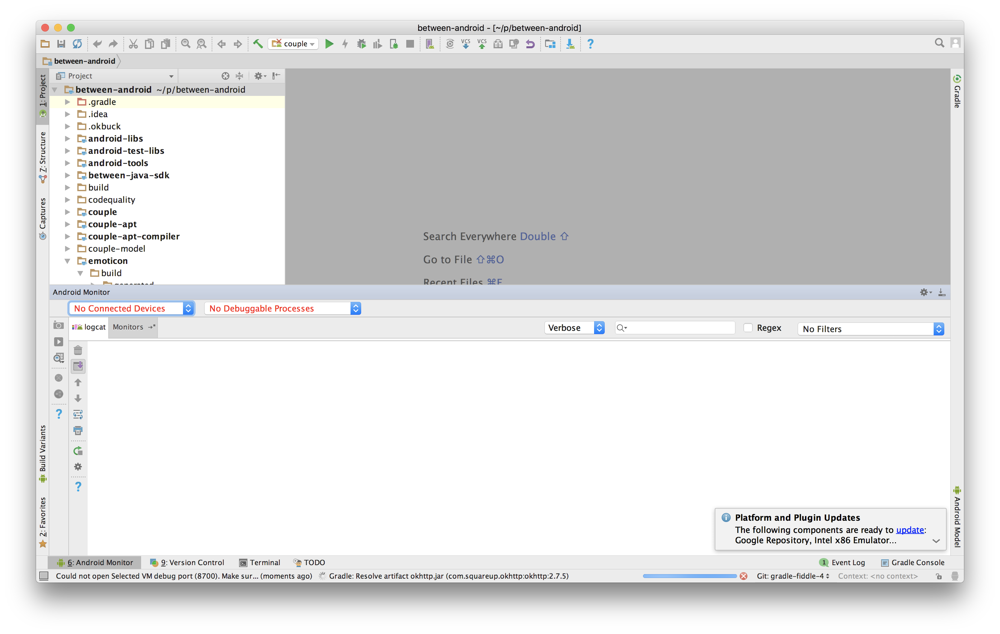
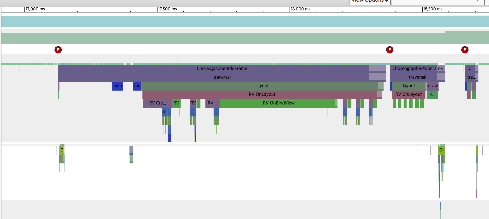
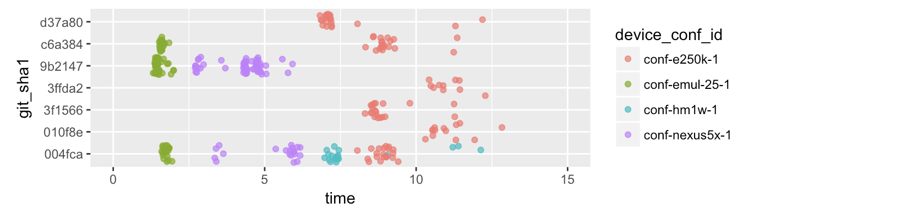

<!-- .slide: data-background="#5D6FA5" -->
<!-- .slide: data-state="terminal" -->
# FlameGraph and Systrace
						
MunShik JOUNG / stephen@vcnc.co.kr

!!!

## Brendan Gregg

!!!

 

!!!


note: Amazon Link https://www.amazon.com/gp/product/0133390098/ref=as_li_ss_tl?ie=UTF8&camp=1789&creative=390957&creativeASIN=0133390098&linkCode=as2&tag=deirdrestraug-20

!!!


!!!


!!!

## Youtube

Linux Performance Tools, Brendan Gregg

!!! 

## Profiling

Sampling Profiler
https://poormansprofiler.org

!!!

# FlameGraph 

Visualization technique

!!!



!!



!!! 

## Data to Vis 

flamegraph.pl

!!!

## Many Area

* MySQL 
* Linux, Solaris
* Java, node.js, ruby 
* Android 

!!!

# aflame.rhye.org



!!!

# Trace

!!!

<!-- .slide: data-background="#5D6FA5" -->
<!-- .slide: data-state="terminal" -->

# Systrace

!!!



!!!

## Google I/O 2017

* Android Performance: Overview
* Android Performance: UI

!!!

## How to Capture
GUI vs CLI

!!

Not in this slide, but ask me if you want.

!!!

## DDMS

```bash
export ANDROID_HVPROTO=ddm
$ANDROID_HOME/tools/monitor
```

!!

* Android Monitor (in Android Studio)
* DDMS == Android Device Monitor

!!



!! 



!!!

## systrace.py

```
$ANDROID_HOME/platform-tools/systrace/systrace.py \
  -a kr.co.vcnc.android.couple -o trace-xyz.html
```

!!

```
adb shell am force-stop $PKG && \
sleep 2 && \
F=~/Documents/trace-`date +%Y%m%d-%H%M`.html; \
$ANDROID_HOME/platform-tools/systrace/systrace.py \
 -b 32768 \
 gfx input view sched freq \
 -a kr.co.vcnc.android.couple \
 -o $F \
&& sleep 2 && open $F
```

note: 여러번 잡으려고 할 때 이렇게 했습니다. 반자동.

!!

E250K(Note2) does not allow us, root permission needed.

!!!

## RecyclerView Systrace 



!! 

## RecyclerView Source

```
class RecyclerView extends ... {
	protected void onLayout(...) {
		Trace.beginSection("RV OnLayout");
		doSomething();
		Trace.endSection();
	}
}
```

!!!

<!-- .slide: data-background="#5D6FA5" -->
<!-- .slide: data-state="terminal" -->

## TRACE

!!!

## How to get Android TRACE File

```
# export ANDROID_SERIAL="0A3C2D8E0F00700A"

adb profile start <pid> /data/loca/tmp/couple-xyz.trace
adb profile stop
adb pull /data/loca/tmp/couple-xyz.trace
```

!!

## Android Monitor

note: TBD android monitor screen shot

!!!

## Upload Trace File 

aflame.rhye.org

note: TBD screenshot 

!!

* Sometimes failed 
* But mostly OK.

!!!

<!-- .slide: data-background="#5D6FA5" -->
<!-- .slide: data-state="terminal" -->

## WORKSHOP

!!!

* select your partner, two person - one team
* each team select alternating tool - systrace, flamegraph
* each team grab data with their tool
* if all team finished their first run
* mix partner
* run another one

!!!

## Scripting Tips

```
export PKG=kr.co.vcnc.android.couple
export LA=kr.co.vcnc.android.couple.feature.LaunchActivity
```

!!

```
H=`git rev-parse HEAD`; 
(for i in `seq 20`; \
  do (time adb shell am start \
      -S \
      -W $PKG/$LA \
      -c android.intent.category.LAUNCHER \
      -a android.intent.action.MAIN); 
  done) \
2> >(tee ~/tmp/$H >&2)
```

!!

```
grep real ~/tmp/$H | \
 ruby -ne ' puts $_.split[1].split("m")[1][0...-1]' | 
 ruby -e 'puts "c(" + $<.readlines.map(&:strip).join(",") + ")" '| 
 pbcopy
```

!!

```
c(1.993,1.492,1.498,1.449,1.441,1.396,1.450,1.431,
  1.470,1.912,1.821,1.778,1.477,1.515,1.484,1.469,
  1.415,1.584,1.524,1.517,1.319,1.370,1.403,1.423,
  1.409,1.368,1.392,1.394,1.384,1.412,1.390,1.415,
  1.396,1.478,1.620,1.465,1.665,1.459,1.415,1.993)
```

!!



!!!
