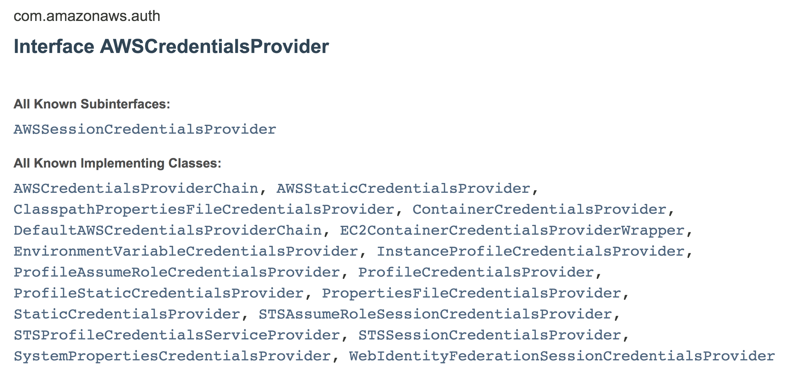
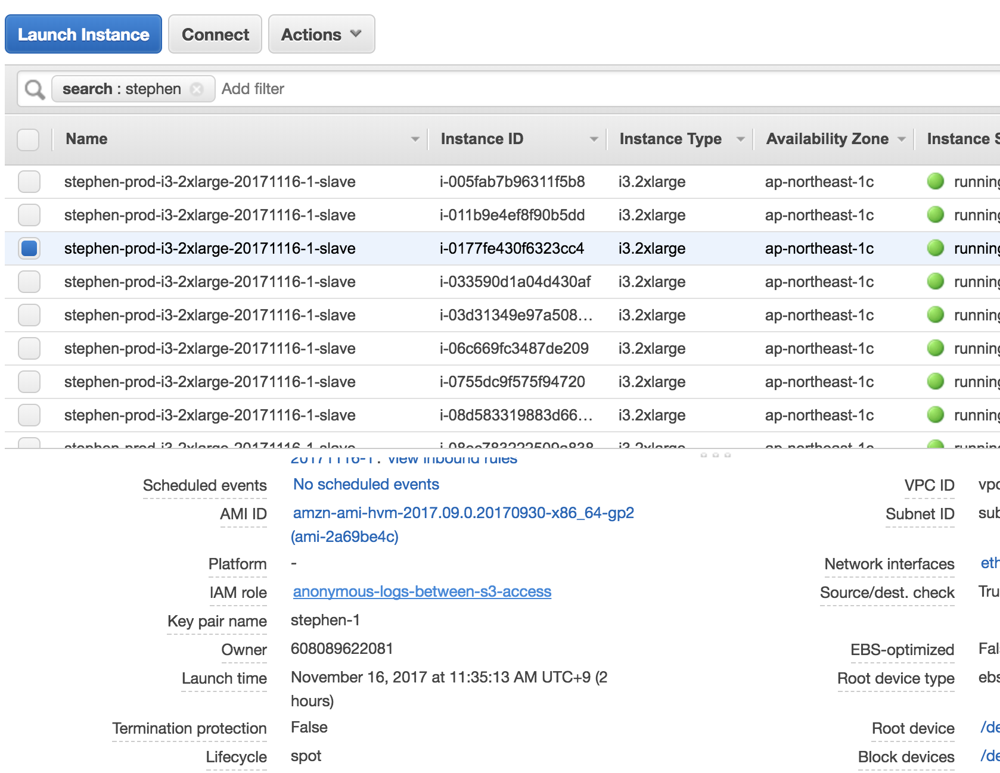
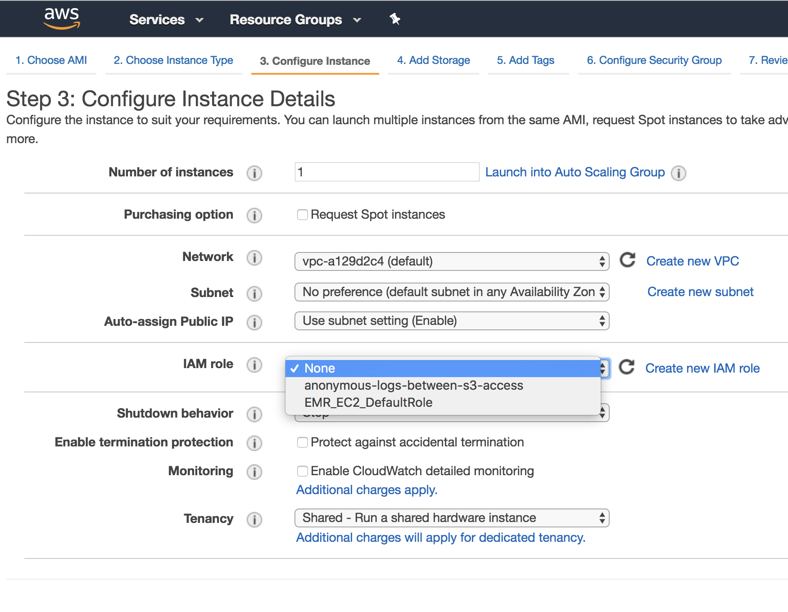
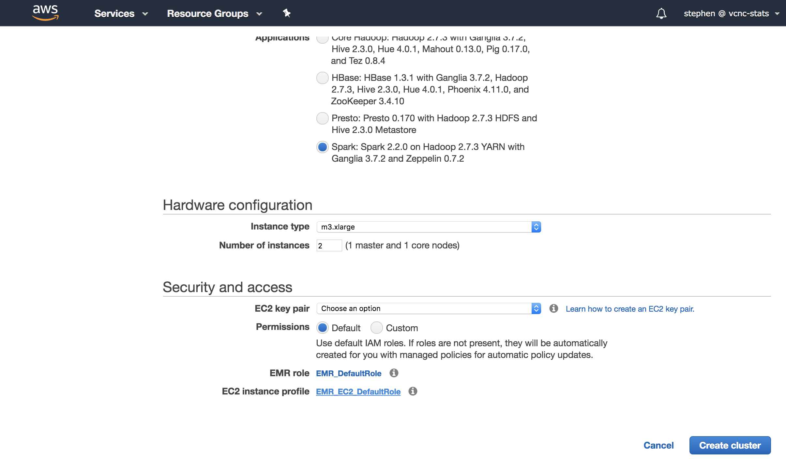

<!-- .slide: data-background="#5D6FA5" -->
<!-- .slide: data-state="terminal" -->
# EC2 Instance Profile
						
MunShik JOUNG / stephen@vcnc.co.kr

!!!

# What is EC2 Instance Profile 

* Container for IAM Role

!!!

# Why use EC2 Instance Profile 

* To use AWS API
* To distribute credential, with security in mind
* To launch {emr,flintrock}-cluster


!!!

# AWS Credential - 1

```
export AWS_ACCESS_KEY_ID = <my access key id>
export AWS_SECRET_ACCESS_KEY = <my secret access key>

```

!!!

# AWS Credential - 2

```
AWSS3Client c = new AWSS3Client()
```

!!! 

# AWS CredentialChain

 

!! 
						
# Default Credential Provider Chain

http://docs.aws.amazon.com/sdk-for-java/v1/developer-guide/credentials.html

* Environment Variable 
* Java system properties - aws.accessKeyId and aws.secretKey
* ~/.aws/credentials
* Amazon ECS container credentials
* Instance profile credentials 

!!! 


<!-- .slide: data-background="#5D6FA5" -->
<!-- .slide: data-state="terminal" -->
# AWS Groccery 

!!!

* Account 
* IAM Group 
* IAM User
* IAM Role 
* Policy 

* InstanceProfile
* ARN

!!! 

# Policy 

Attach Policy to Role 

!!! 

# Policy Sample

arn:aws:iam::608089622081:policy/s3-full-access-and-anonymous-logs-between-read

```
{
    "Effect": "Allow",
    "Action": "s3:ListAllMyBuckets",
    "Resource": "arn:aws:s3:::*"
}
```

!!!

 

!!!

 

!!! 

# flintrock 

```
flintrock launch $C \
 ...
 --ec2-user ec2-user \
 --ec2-instance-profile-name anonymous-logs-between-s3-access \
 ...
 --ec2-instance-type i3.2xlarge
```

!!! 

 

!!!

* Account - "vcnc", S3 bucket: ananymous-logs-between 
* Account - "vcnc-stats", IAM user "analytics" 
* Account - "vcnc-stats", IAM role "anonymous-logs-between-s3-access" 

S3 Management Console 
- permission granted to (user "analytics", role "anonymous-logs-between-s3-access")
- not with policy

!!!

